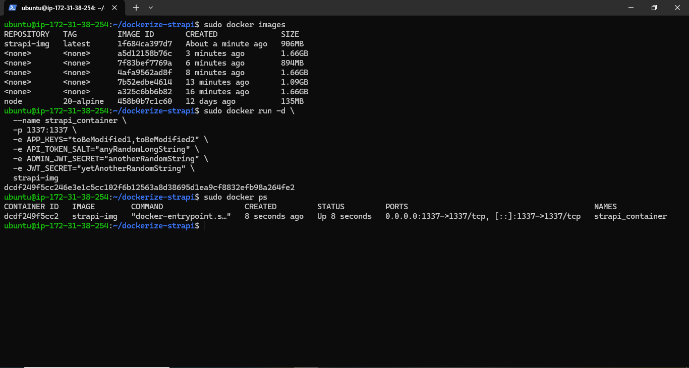
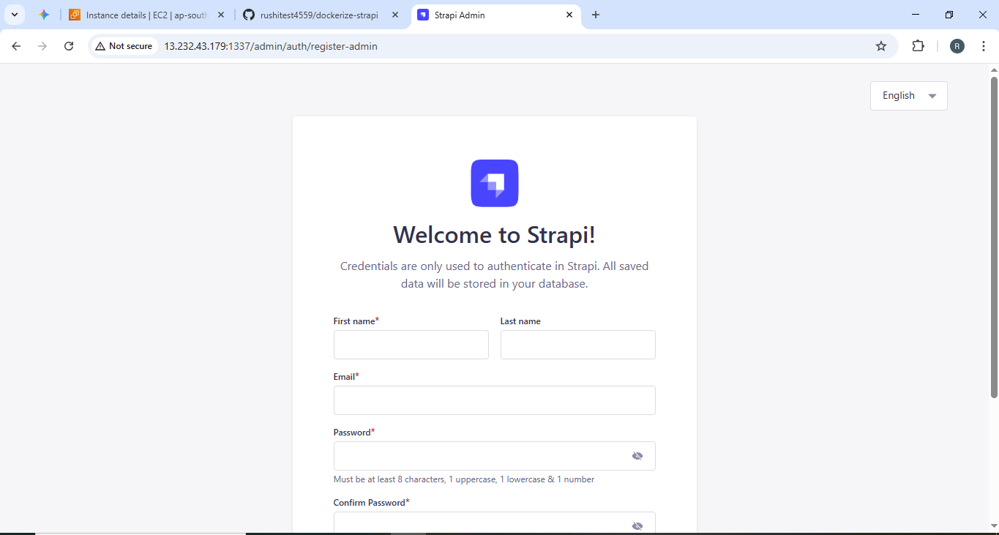

# Strapi Docker Optimization
- **Final Image Size:** 906MB (Optimized from 1.66GB via Multi-Stage build).
- **Optimization:** We used `node:20-alpine`, pruned dev-dependencies with `npm prune --omit=dev`, and discarded build-tools in the final runtime stage.

### Run Command
```bash
sudo docker run -d --name strapi_container -p 1337:1337 \
  -e APP_KEYS="toBeModified1,toBeModified2" \
  -e API_TOKEN_SALT="anyRandomLongString" \
  -e ADMIN_JWT_SECRET="anotherRandomString" \
  -e JWT_SECRET="yetAnotherRandomString" \
  strapi-img
```

### Build Statistics & Startup

