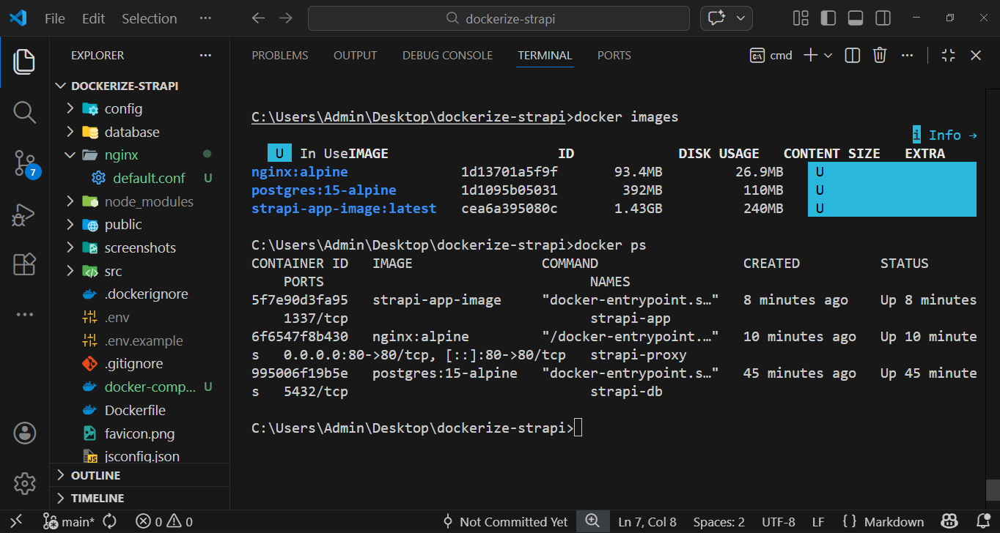
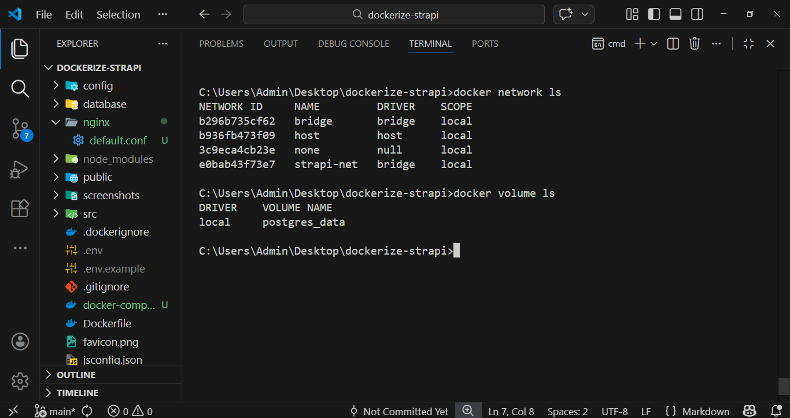
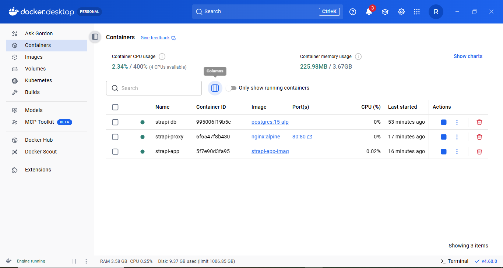
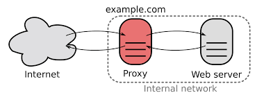

# Strapi Docker Optimization






# RUN this command and it will start 3 containers:
- strapi-db: postgres database for storing strapi data
- strapi-app: actual strapi application
- strapi-proxy: nginx proxy app 
### after this command runs successfully (it may take some minutes), enter `http://localhost` in your browser and you will see it redirects to strapi app.
```bash
docker-compose up -d
```

## What is nginx?
- Nginx is a modern, high‑performance web server that can __serve static web pages__ and is widely used as a __reverse proxy__.

## What is reverse proxy?
- A reverse proxy is a server that __sits in front of your backend applications, receives all external requests, and forwards them to the right internal service while hiding the real server from the outside world__.



## Why we need reverse proxy?
- The exact reason is: __centralized security and routing__ —you expose only the reverse proxy to the world, hide your real servers behind it, and handle security, SSL, and path‑based or host‑based routing in one place instead of on every service.

# Dockerfile explained

### Q: Why do we use node:20-alpine in both stages instead of node or node-slim in the first stage?
- __A:__ We use `node:20-alpine` in both stages because builds done on non‑Alpine Node images may fail when run on Alpine; using the same lightweight Alpine base in both stages keeps compatibility and minimizes final image size.

### official node images size: node:20 > node:20-slim > node:20-alpine

### Q: Why do we need to install extra libraries and packages in node:alpine before building or running Strapi?
- __A:__ Because the `node:alpine` image is very minimal and lacks many required build and runtime libraries, so we must install them explicitly (like build tools and vips).
ex. RUN apk add --no-cache build-base gcc autoconf automake libtool vips-dev (in 1st stage) and RUN apk add --no-cache vips (in 2nd stage)

### Q: Why do we copy only package.json (and package-lock.json) first instead of the complete code?
- __A:__ Because copying manifests first lets Docker cache node_modules separately, so dependencies are only reinstalled when they change, not on every code edit, it improves build speed in CI pipelines.

### Q: What does npm install --frozen-lockfile do and why do we use it in builds?
- __A:__ --frozen-lockfile skips searching for newer versions and just installs exactly what’s in package-lock.json, so builds are faster and more consistent; it also prevents accidental version changes unless we explicitly update the lockfile ourselves.

### Q: What does RUN npm prune --omit=dev && npm cache clean --force do after the build?
- __A:__ It removes all devDependencies and leftover “extraneous” packages from node_modules and then deletes the npm cache inside the container, making the final image smaller and production‑only.

# Docker Compose explained

### Q: Why do we need Docker Compose—are plain Docker commands not enough?
- __A:__ Docker Compose lets us declare and run multi‑container apps with one file instead of running many manual docker run commands. we define all our containers in docker-compose.yml file and run only one command: `docker-compose up -d` and see all containers running.

### Q: What does the restart: unless-stopped setting do in each service?
- __A:__ It tells Docker to automatically restart the container if it crashes or the host reboots, but leave it stopped if you manually stop it with docker compose stop or docker stop.

### Q: For these three containers, how many ports are exposed to the world?
- __A:__ Only one port is exposed to the world: port 80 from strapi-proxy; the strapi-app and strapi-db containers are private, reachable only inside the network via their service names.