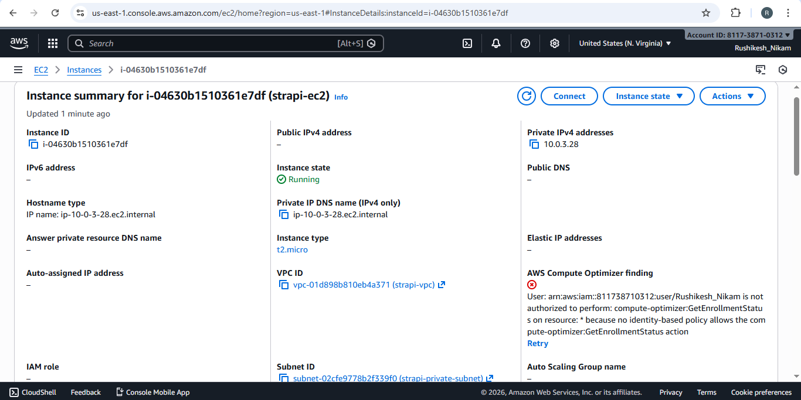
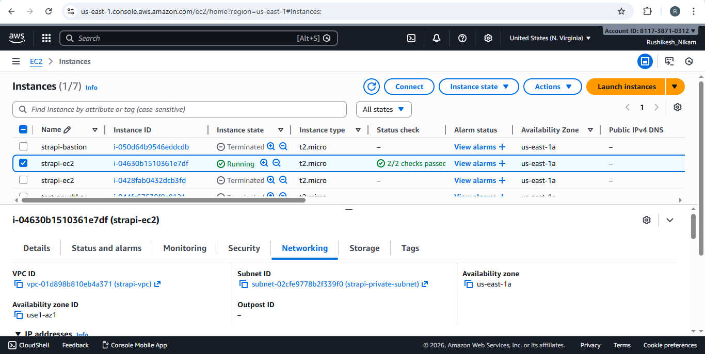
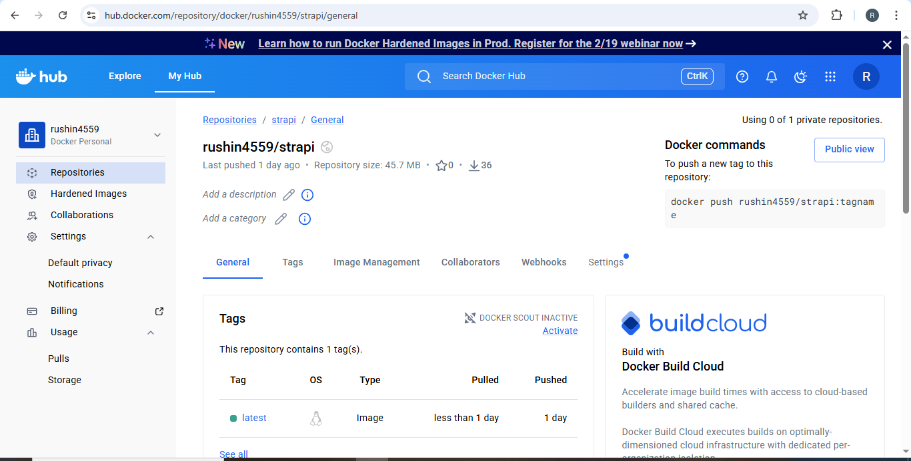
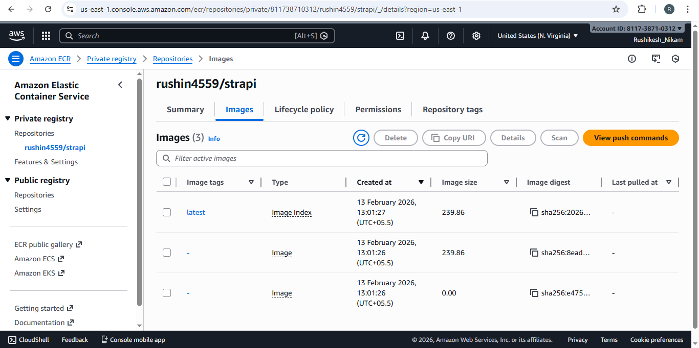
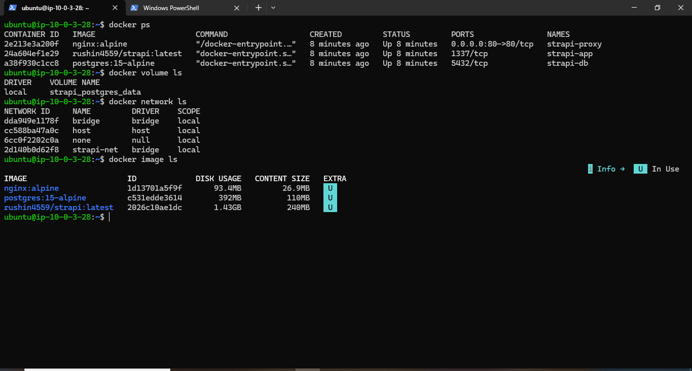
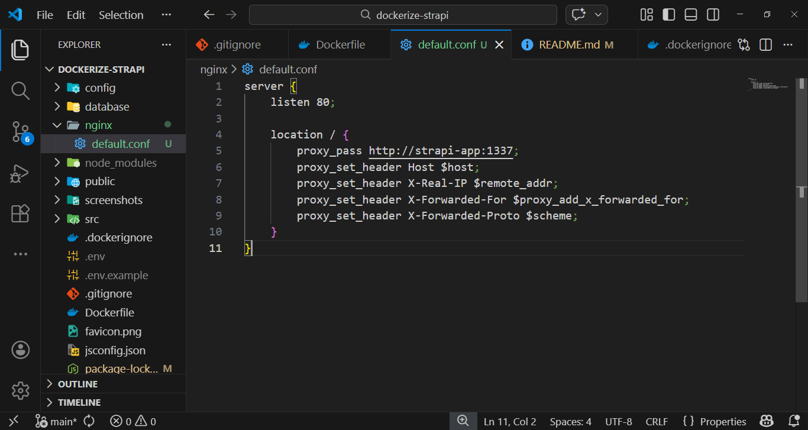
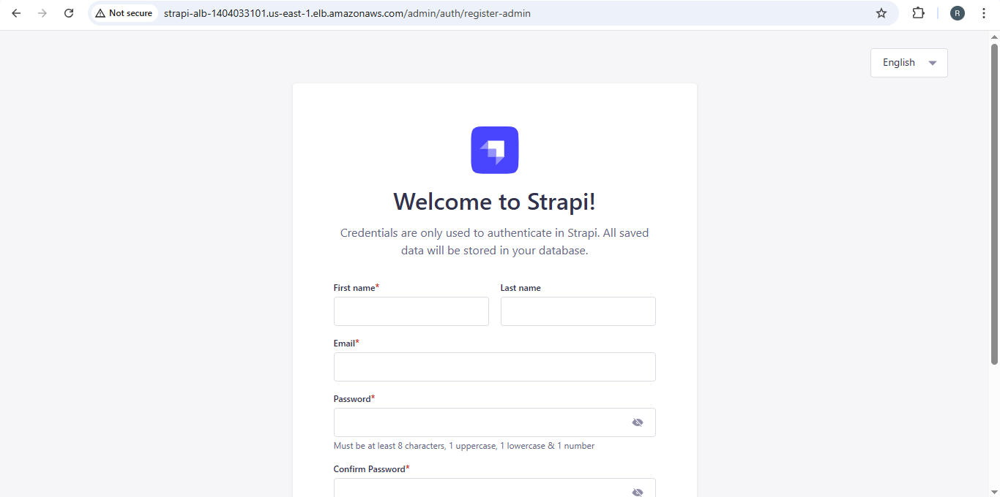
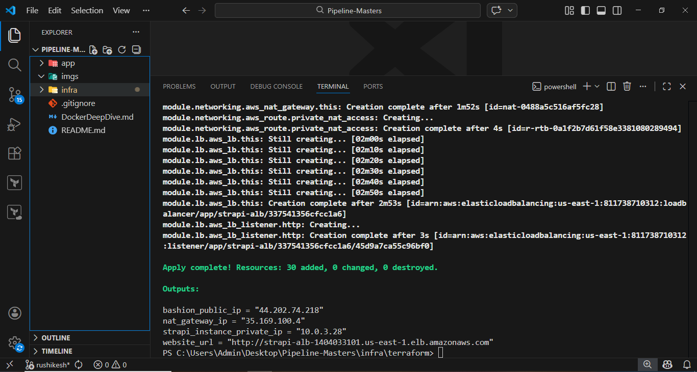

[user data](./infra/terraform/user_data.sh)

# Steps

```bash
cd .\infra\terraform
terraform apply --auto-approve
```

## Copy paste this command & boom! 3 containers start in your instance which is in private subnet. Enter the website_url in browser.