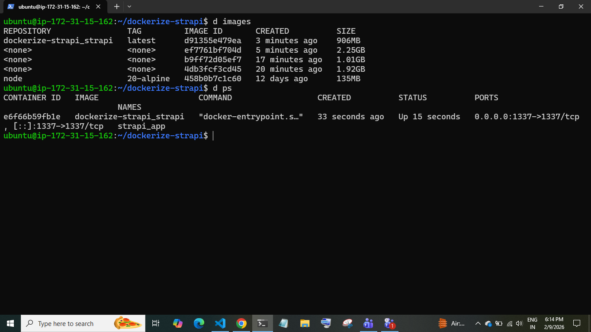

# Strapi Docker Quick Start

## Steps
1. Install Docker & Docker Compose
2. alias d="sudo docker" && alias dc="sudo docker-compose"
3. dc up -d (wait ~15 min)
4. d ps → verify running

## Screenshots

